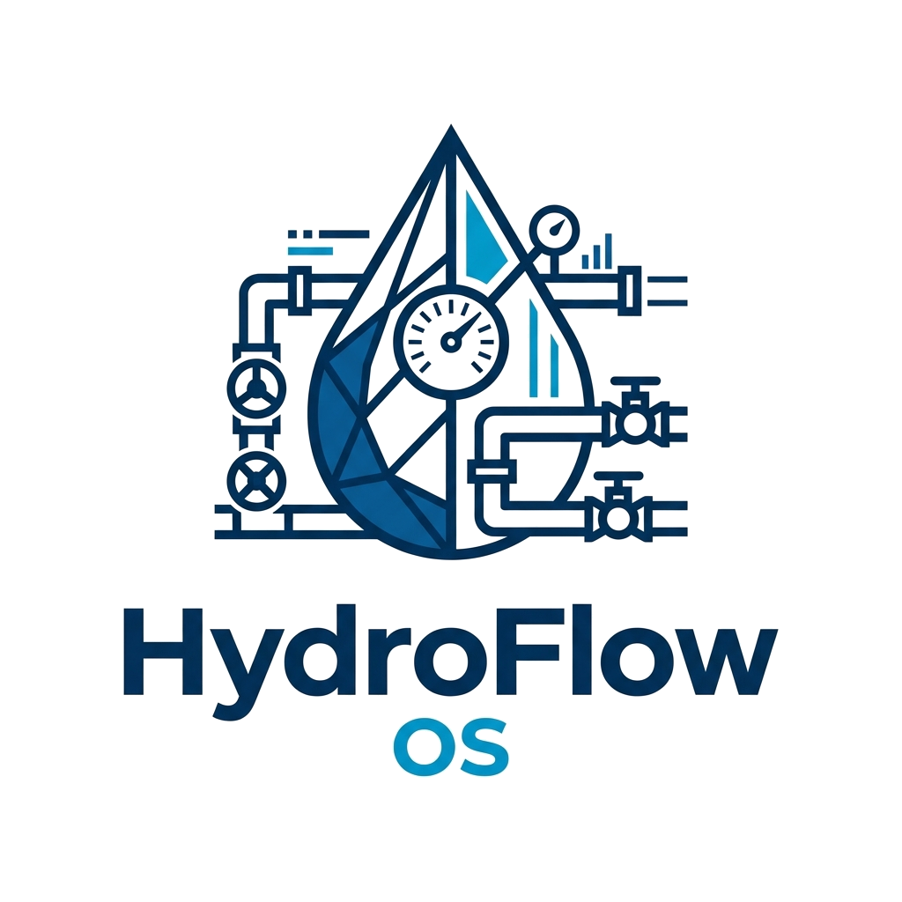

# HydroFlow OS: Municipal Water Distribution Network Pressure Regulation, Surge Protection, and Energy Optimization Engine

<p align="center">
  
</p>

<p align="center">
  <strong>Evaluated Course Project</strong> | <strong>Course Code:</strong> CSE2006 (Programming in Java)<br>
  <strong>Institution:</strong> Vellore Institute of Technology (VIT) Bhopal University<br>
  <strong>Student:</strong> Mayank Chaudhary (Registration: 24BEC10011)<br>
  <strong>College Email:</strong> <a href="mailto:mayank.24bec10011@vitbhopal.ac.in">mayank.24bec10011@vitbhopal.ac.in</a><br>
  <strong>GitHub Email:</strong> <a href="mailto:mayankchaudhary21811@gmail.com">mayankchaudhary21811@gmail.com</a><br>
  <strong>Academic Term:</strong> Fall Semester 2026 to 2027<br>
  <strong>Official Repository:</strong> <a href="https://github.com/mayankchaudhary21811-creator/hydroflow-os">https://github.com/mayankchaudhary21811-creator/hydroflow-os</a>
</p>

---

## 1. Executive Overview

HydroFlow OS is an open architecture Java core engine designed for municipal water distribution grid dispatching, booster pump energy optimization, and pipeline transient water hammer surge protection.

Municipal water distribution networks present distinct operational challenges:
- Hydraulic head loss accumulates non-linearly across aging pipeline grids according to pipe diameter, wall roughness, and instantaneous volumetric demand.
- Sudden demand drops or emergency valve closures trigger Joukowsky water hammer pressure transients that can exceed pipe PN ratings, risking catastrophic pipe bursts.
- Parallel pumping stations face electrical transformer ceilings, requiring intelligent pump dispatch across fixed-speed and variable-frequency drives.
- Remote pressure and water quality sensors stream high-frequency data packets that must be ingested without blocking operator dispatch routines.
- Elevated municipal reservoirs require continuous volume monitoring to preserve mandatory 15% emergency reserves for fire flow and system buffering.

HydroFlow OS models and resolves each of these constraints in standard Java SE with zero third-party dependencies.

---

## 2. Core Architectural Principles

The application is structured into four decoupled layers:
- Presentation Layer: Interactive terminal console menu and evaluation demonstration runner with ANSI formatting.
- Domain Physics Layer: Object-oriented models for pipelines, elevated reservoir tanks, and polymorphic booster pump trains.
- Protection and Interlock Layer: Custom checked exception hierarchy validating net positive suction head and water hammer pressure limits before actuation.
- Infrastructure and Persistence Layer: Asynchronous sensor worker threads and stream-based CSV persistence using try-with-resources.

---

## 3. Mathematical Foundations

### 3.1 Pipeline Friction Loss (Hazen-Williams Formulation)
Frictional head loss along distribution pipelines is calculated via the empirical Hazen-Williams equation:

$$h_f = 10.67 \times L \times \frac{Q^{1.852}}{C^{1.852} \times D^{4.87}}$$

Variable definitions:
- $h_f$ is hydraulic head loss in meters of water column.
- $L$ is pipeline segment length in meters.
- $Q$ is volumetric flow rate in cubic meters per second ($m^3/s$).
- $C$ is the Hazen-Williams roughness coefficient (130 for ductile iron, 140 for HDPE).
- $D$ is internal pipe diameter in meters.

### 3.2 Transient Water Hammer Surge (Joukowsky Equation)
Sudden flow deceleration creates acoustic pressure shockwaves:

$$\Delta P = \rho \times a \times \Delta v$$

Variable definitions:
- $\Delta P$ is transient surge pressure in Pascals ($1\text{ bar} = 100,000\text{ Pa}$).
- $\rho$ is fluid density ($1000\text{ kg}/m^3$).
- $a$ is acoustic pressure wave velocity in fluid-filled conduit ($1050\text{ m}/s$).
- $\Delta v$ is the instantaneous change in fluid velocity ($m/s$).

If the sum of static baseline pressure and $\Delta P$ exceeds the maximum pipeline rating (e.g. PN16 = 16.0 bar), dispatch throws a `PipeBurstSurgeException`.

### 3.3 Pump Power Scaling and Affinity Control
Hydraulic power and motor electrical draw are calculated as:

$$P_{elec} = \frac{\rho \times g \times Q \times H}{1000 \times \eta}$$

Variable Frequency Drive (VFD) units apply centrifugal affinity laws to reduce energy consumption during low-demand periods, yielding substantial kilowatt-hour savings over fixed-speed centrifugal throttling.

---

## 4. Object-Oriented Domain Models

| Component | Concrete Class | Primary Metric | Physics Model |
| :--- | :--- | :--- | :--- |
| **Elevated Storage Reservoir** | `ReservoirTank` | 15% emergency reserve | Volumetric balance and gravity pressure head |
| **Fixed-Speed Booster Pump** | `FixedSpeedCentrifugalPump` | Rated 60.0 L/s @ 45m | Throttled quadratic head-flow curve |
| **Variable-Frequency Pump** | `VariableFrequencyDrivePump` | Rated 90.0 L/s @ 55m | Affinity law continuous frequency modulation |
| **Submersible Deep-Well Pump** | `SubmersibleBoosterPump` | Rated 40.0 L/s @ 95m | Multi-stage series impeller pressure boosting |
| **Distribution Pipeline** | `DistributionPipeline` | PN16 pressure rating | Hazen-Williams friction and Joukowsky water hammer |

---

## 5. Curriculum Alignment (CSE2006 Programming in Java)

HydroFlow OS maps directly to the five units of the CSE2006 syllabus:

| Syllabus Unit | Core Java Feature | Concrete HydroFlow OS Implementation |
| :--- | :--- | :--- |
| **Unit 1: Flow Control & Data Types** | Switch expressions, loops, primitives | Interactive terminal menu navigation, double-precision head calculations |
| **Unit 2: Object-Oriented Principles** | Inheritance, super keyword, encapsulation | `WaterNetworkNode` abstract base, parameterized `Pump` subclasses |
| **Unit 3: Interfaces & Polymorphism** | Abstract methods, decoupled contracts | `HydraulicActuator`, `PressureRegulator`, dynamic dispatch on `calculateElectricalPowerKw` |
| **Unit 4: Exceptions & Multithreading** | Checked exceptions, `Runnable` interface | `HydroFlowException` hierarchy, `PressureSensorTelemetryWorker` background thread |
| **Unit 5: Collections & File I/O** | `PriorityQueue`, `LinkedHashMap`, streams | Lowest fill refill priority queue, `BufferedReader`/`BufferedWriter` CSV persistence |

---

## 6. Directory Layout

```text
mayank vityarthi/
├── repo/
│   ├── bin/                          # Compiled bytecode class files
│   ├── data/                         # CSV inventory and persistent audit event logs
│   ├── docs/
│   │   ├── assets/                   # Vector logos for project and institution
│   │   ├── HydroFlow_OS_Project_Report.docx  # Full evaluated course project report
│   │   └── HydroFlow_OS_Project_Report.pdf   # 15-page academic submission PDF
│   ├── src/
│   │   └── com/
│   │       └── hydroflow/
│   │           ├── cli/              # HydroFlowApp console entry point
│   │           ├── core/             # Nodes, reservoirs, pipelines, actuator contracts
│   │           ├── exceptions/       # Checked and unchecked domain exception hierarchy
│   │           ├── io/               # File stream persistence managers
│   │           ├── pump/             # Polymorphic pump implementations
│   │           ├── telemetry/        # Multithreaded sensor packet streaming
│   │           └── test/             # Standalone unit test suite
│   ├── .gitignore                    # Build artifact ignore rules
│   ├── LICENSE                       # MIT License
│   └── README.md                     # Comprehensive technical documentation
└── report/                           # Standalone local report compilation directory
```

---

## 7. Compilation & Execution

### Clone Repository
```bash
git clone https://github.com/mayankchaudhary21811-creator/hydroflow-os.git
cd hydroflow-os
```

### Prerequisites
- Java Development Kit (JDK) 8 or higher (compatible with OpenJDK 11, 17, 21, and Oracle JDK 21).
- Terminal console environment on Windows, Linux, or macOS.

### Compile All Source Files
From the `repo` root directory, compile all source files into the `bin` directory:

```bash
# Windows PowerShell
javac -d bin (Get-ChildItem -Recurse -Filter *.java src | ForEach-Object { $_.FullName })

# Linux / macOS Bash
javac -d bin $(find src -name "*.java")
```

### Run the Unit Test Suite
Execute the standalone test suite with assertions enabled:

```bash
java -ea -cp bin com.hydroflow.test.HydroFlowTestSuite
```

Expected output:
```text
=================================================================
              RUNNING HYDROFLOW OS UNIT TEST SUITE               
=================================================================
  [PASS] testNodeIdentifierValidation          ... OK
  [PASS] testPolymorphicPowerCalculation         ... OK
  [PASS] testReservoirDepletionInterlock         ... OK
  [PASS] testWaterHammerSurgeProtection          ... OK
  [PASS] testMultithreadedSensorWorker           ... OK
  [PASS] testCsvPersistenceRoundtrip             ... OK
=================================================================
TEST RESULTS: 6 / 6 PASSED (Success Rate: 100.0%)
=================================================================
```

### Run the Evaluation Demonstration
Run the end-to-end operational evaluation trace:

```bash
java -cp bin com.hydroflow.cli.HydroFlowApp --demo
```

---

## 8. License

This project is licensed under the MIT License. See [LICENSE](LICENSE) for complete terms.
